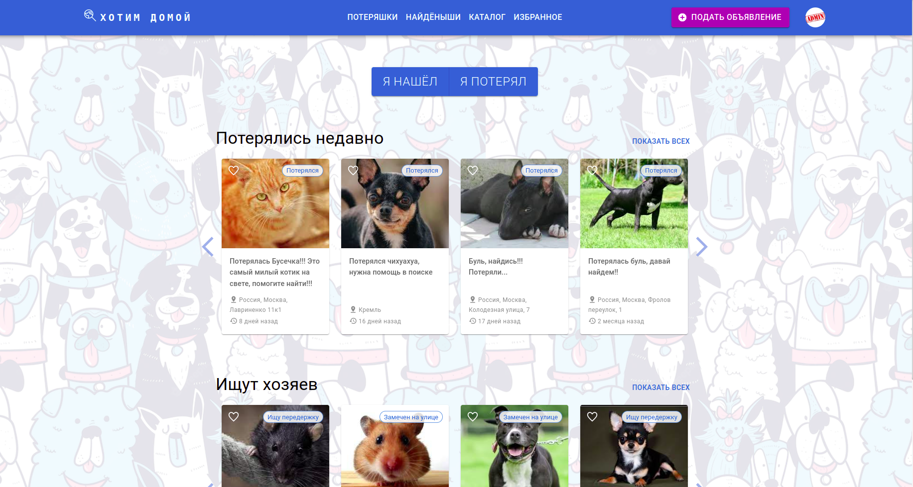
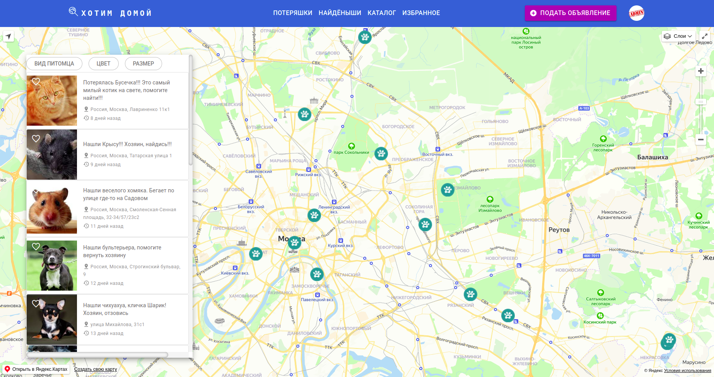
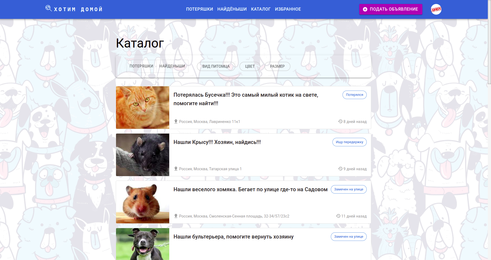
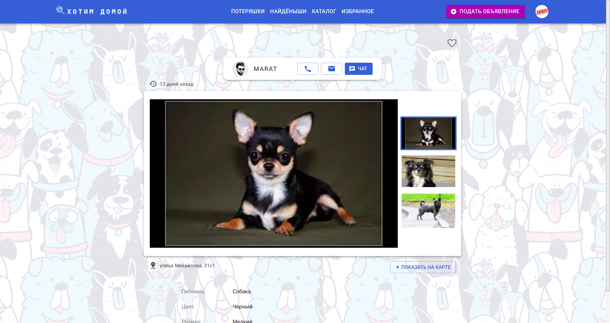
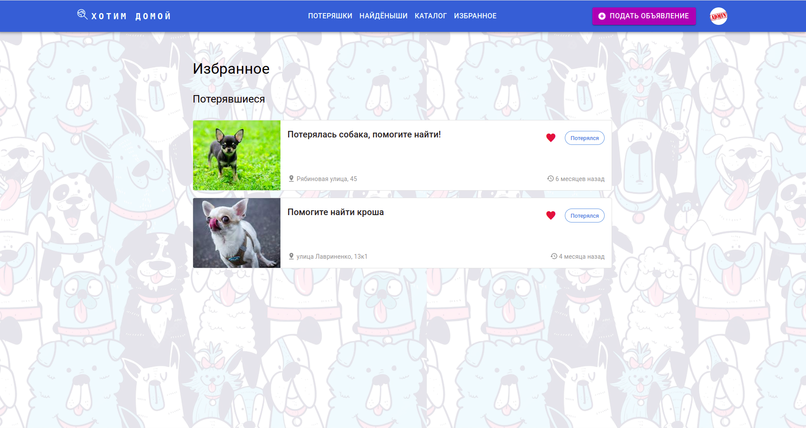
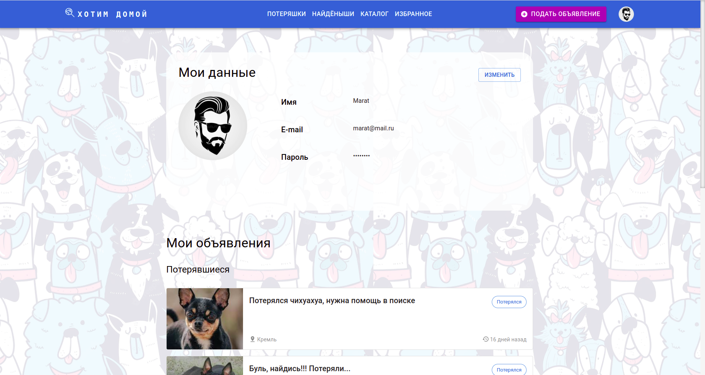

# Хотим домой (командный проект)
<h3>
Хотим домой - это сервис для размещения объявлений о потерянных и найденных животных.
</h3>

<h4>
Представляем несколько принскринов нашего приложения:
</h4>

Главная страница. Все начинается именно отсюда :))

Одна из главных "фишек" нашего проекта - возможность отображения на карте всех объявлений пользователей (потерянных животных - во вкладке "Потеряшки", найденных - во вкладке "Найденыши").

Также можно посмотреть список всех объявлений, применить необходимые фильтры для удобства поиска.

Зайдя в карточку конкретного животного, можно посмотреть подробную информацию о нем. Кроме того, можно связаться с пользователем, разместившим объявление, посредством телефона, емайла, а также отправить сообщение в чат.

Конечно же, любое объявление можно добавить в избранное.

В личном кабинете Вы можете загрузить/изменить личное фото, отредактировать данные, а также посмотреть список размещенных Вами объявлений.

